# Renfild

[](https://github.com/t0mer/renfild/releases)
[](LICENSE)
[](https://github.com/t0mer/renfild/actions/workflows/ci.yml)

A self-hosted voice assistant that runs on a Raspberry Pi and **knows who is talking to it**.

Renfild listens for a wake word you trained yourself, works out *which member of the
household* said it from the sound of their voice, and only then decides what to do.
Speech-to-text, speaker recognition, the language model and the voice all run on your own
hardware. Nothing leaves your network.

- 🎙️ **Custom wake word** — an [openWakeWord](https://github.com/dscripka/openWakeWord) model you train yourself.
- 🧑‍🤝‍🧑 **Speaker recognition** — ECAPA-TDNN voice embeddings; every intent has a permission floor.
- 🧠 **Rules first, LLM second** — a deterministic rule table you own, with a local Ollama fallback.
- 🔒 **Local only** — no cloud, no telemetry, no Home Assistant dependency. Raw audio is not stored by default.
- 📦 **No Docker** — three systemd units, one installer, native on Raspberry Pi OS.

---

## Architecture

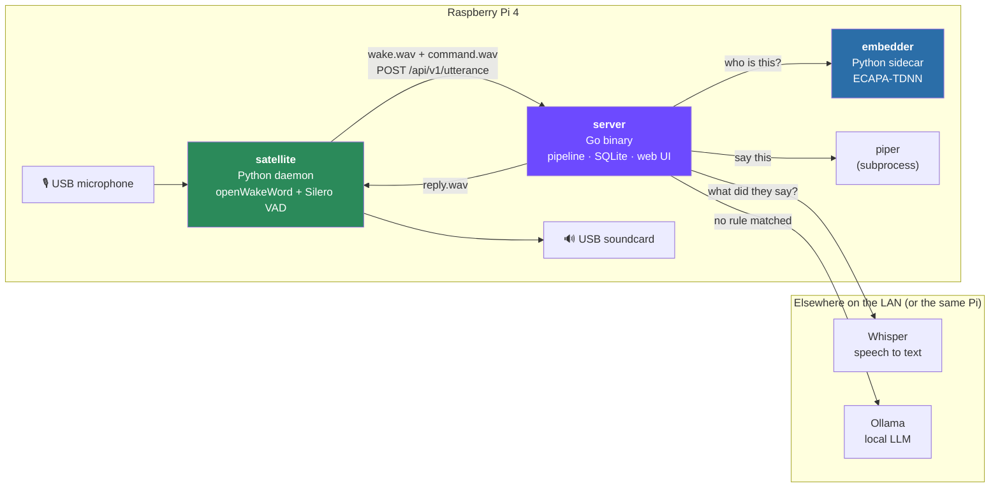

One utterance, end to end:

1. The satellite keeps the **last 2 seconds** of microphone audio in a ring buffer at all times.
2. The wake word fires → that 2-second snapshot becomes `wake.wav`, and a chirp plays immediately.
3. Silero VAD records the command until **700 ms of silence** (or 10 s, whichever comes first).
4. The server embeds `wake.wav` and transcribes `command.wav` **concurrently**.
5. The embedding is matched against every enrolled speaker by cosine similarity.
6. The intent router walks the rule table by priority; the first enabled match that clears the
   speaker's role floor wins. No match → the local LLM, if you have enabled it.
7. Piper speaks the reply. Everything — speaker, scores, transcript, intent, per-stage latency —
   lands in the history table.

---

## Hardware

| Part | What I use | Notes |
|---|---|---|
| Computer | Raspberry Pi 4, 4 GB, arm64 | Raspberry Pi OS (Debian 13). A Pi 5 is faster but not required. |
| Microphone | Any USB microphone or conference mic | Must appear in `arecord -L`. A far-field mic makes a big difference. |
| Speaker | USB soundcard + powered speaker | The Pi's headphone jack works, but sounds worse. |
| Storage | 32 GB SD card or better | PyTorch alone takes ~1.5 GB. |
| Elsewhere | A host running Whisper and Ollama | Optional — both can run on the Pi, just slower. |

---

## Quickstart

```bash
git clone https://github.com/t0mer/renfild.git
cd renfild
sudo ./install.sh
```

The installer creates the `renfild` system user, builds the Python virtualenvs, downloads
Piper and a voice, installs three systemd units and starts them. It is idempotent — re-run
it to upgrade, and it will never overwrite a config file you have edited.

Then:

1. **Drop in your wake word model** — `/opt/renfild/satellite/models/`, and point
   `wake.model_path` in `/opt/renfild/etc/satellite.yaml` at it (see [Training a wake word](#training-a-wake-word)).
2. **Pick your audio devices** — `arecord -L` and `aplay -L` list them; set
   `audio.input_device` / `audio.output_device` to a distinctive part of the name.
3. **Point at Whisper and Ollama** — `/opt/renfild/etc/server.yaml`.
4. **Open the web UI** — `http://<pi>:8080` — and enroll yourself under **Speakers**.

```bash
systemctl status renfild-server renfild-embedder renfild-satellite
journalctl -u renfild-satellite -f      # watch it hear you
```

### Building from source

Everything builds natively on the Pi; there is no cross-compilation step and no Docker.

```bash
make venvs        # Python virtualenvs for the satellite and embedder
make web          # build the React UI into the Go embed directory
make build        # build ./server/renfild with the UI embedded
make test         # Go + Python test suites
make e2e          # end-to-end pipeline check with mocked external services
```

---

## Components

### satellite (Python)

The always-on ear. Captures 16 kHz mono audio in 80 ms frames, runs openWakeWord on every
frame, records the command with Silero VAD and ships both WAVs to the server.

```bash
# See what audio devices exist
/opt/renfild/satellite/.venv/bin/python -m satellite --list-devices

# Tune the wake word by ear: capture to disk, never contact the server
/opt/renfild/satellite/.venv/bin/python -m satellite --offline --dump-dir /tmp/renfild
```

### embedder (Python)

One job: audio in, a 192-dimension voice embedding out. It exists because SpeechBrain's
ECAPA-TDNN model is Python-only — all the matching logic lives in the Go server.

```bash
curl -s --data-binary @sample.wav -H 'Content-Type: audio/wav' \
  http://127.0.0.1:8100/embed | head -c 200
```

> **Note** SpeechBrain pulls in PyTorch. On arm64 the installer uses the **CPU-only** wheels
> from PyTorch's own index (~1.5 GB on disk) — the default PyPI wheels drag in several
> gigabytes of NVIDIA CUDA packages that are useless on a Pi. The ECAPA model (~80 MB) is
> downloaded on first start into `/opt/renfild/embedder/models` and everything runs offline
> after that.

### server (Go)

The brain: speaker ID → speech to text → intent → speech. Owns the SQLite database and
serves the web UI from inside the binary (`CGO_ENABLED=0`, nothing to install but the file).

---

## The web UI

Everything is configurable from the browser at `http://<pi>:8080`. The UI is embedded in the
server binary — there is nothing else to deploy — and follows your system's light/dark
preference, with a toggle in the navbar.

### Dashboard

Live utterances over Server-Sent Events, per-stage latency, and who has been talking.

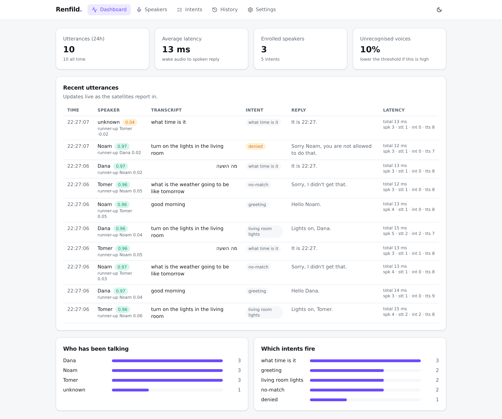
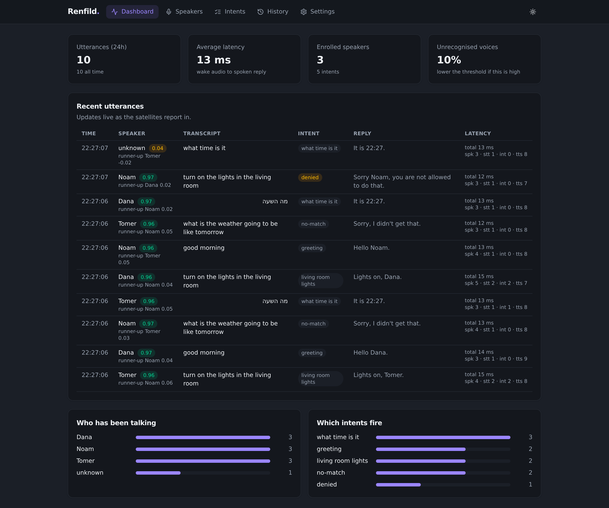

### Speakers

Who is enrolled, how many samples each of them has, and the "test my voice" panel.

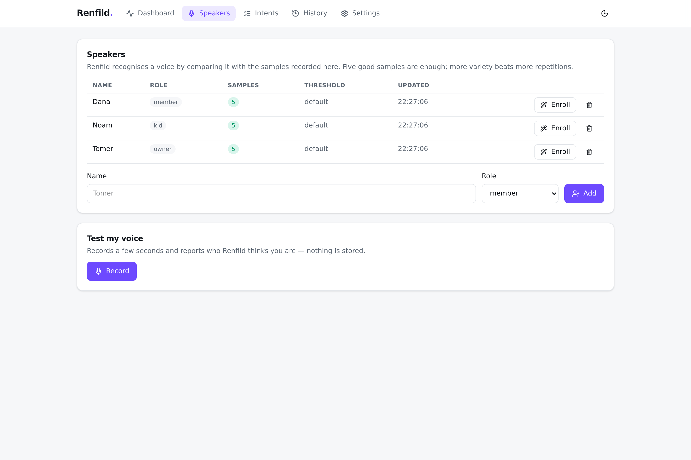
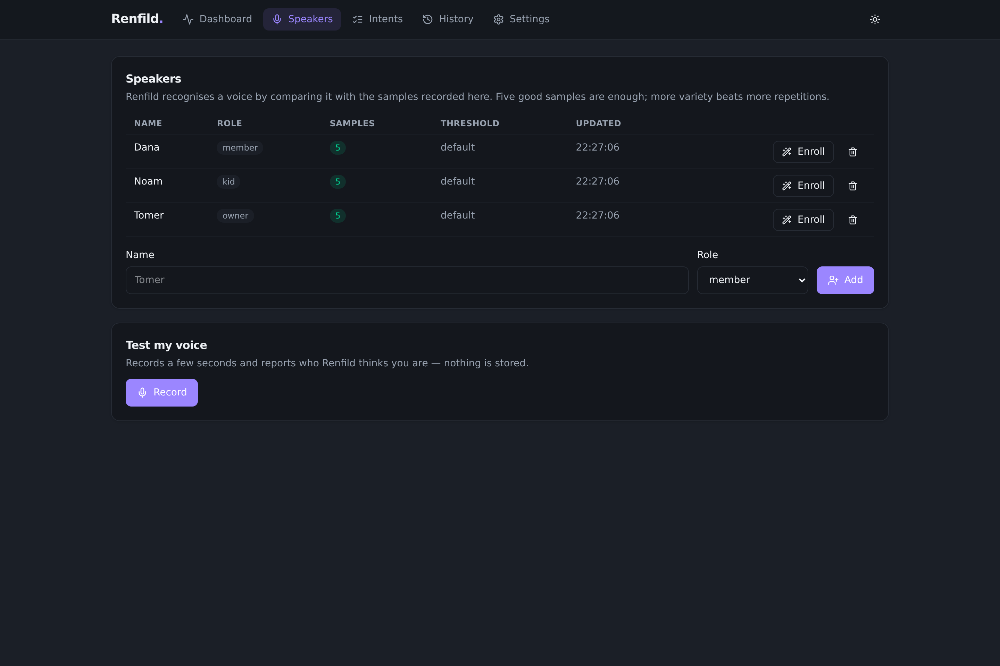

The enrollment wizard itself is covered under [Enrolling a speaker](#enrolling-a-speaker).

### Intents

The rule table, in priority order, with a dry-run box that routes a phrase as if a given
person had said it.

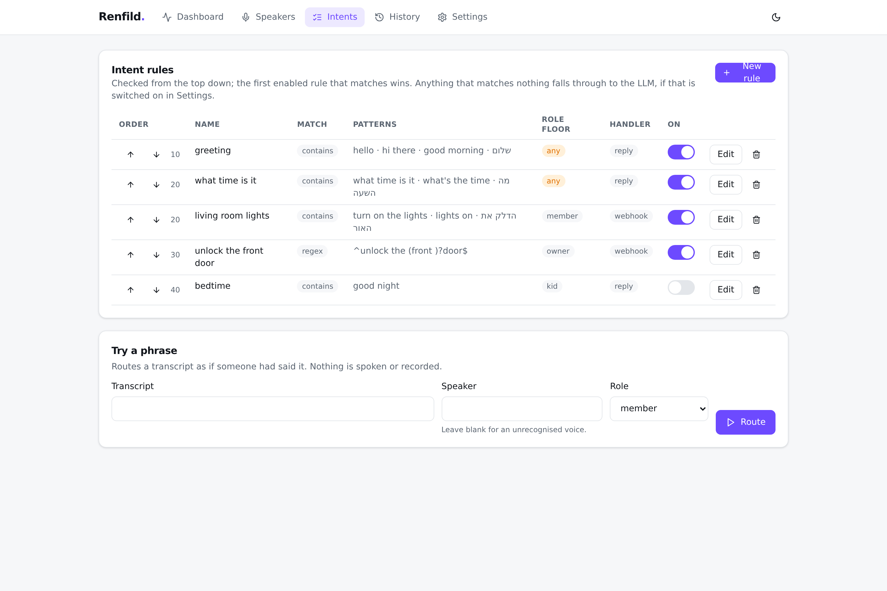
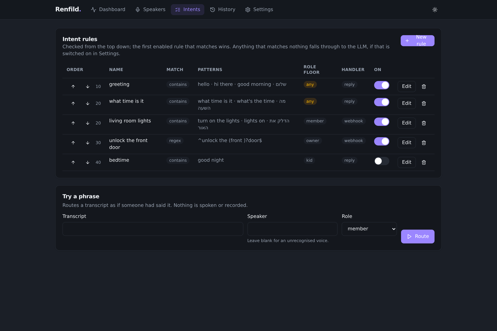

### History

Every utterance with its speaker scores, transcript, intent, reply and per-stage timings.
This is the page you tune thresholds from.

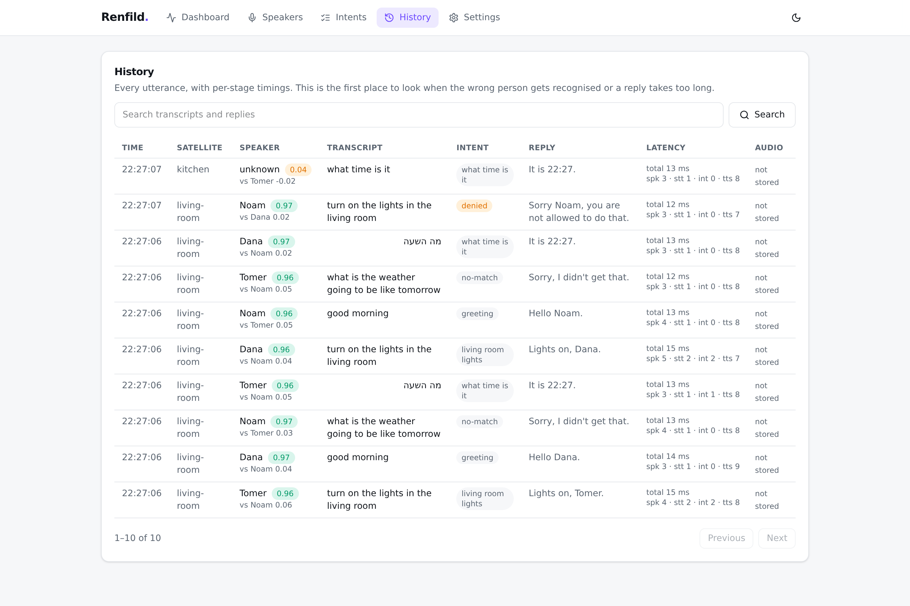
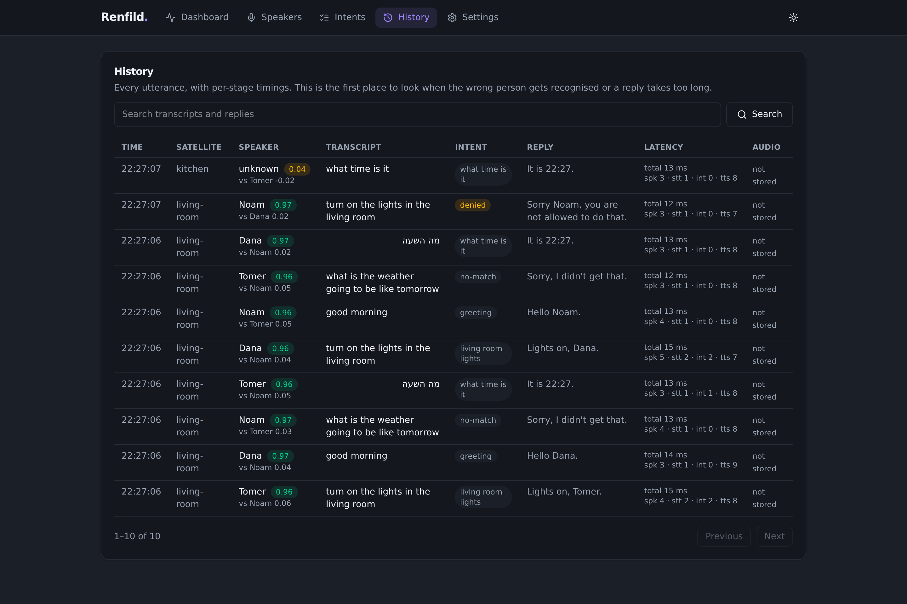

### Settings

Thresholds and policies apply immediately and survive a restart; the values that come from
the config file are shown read-only.

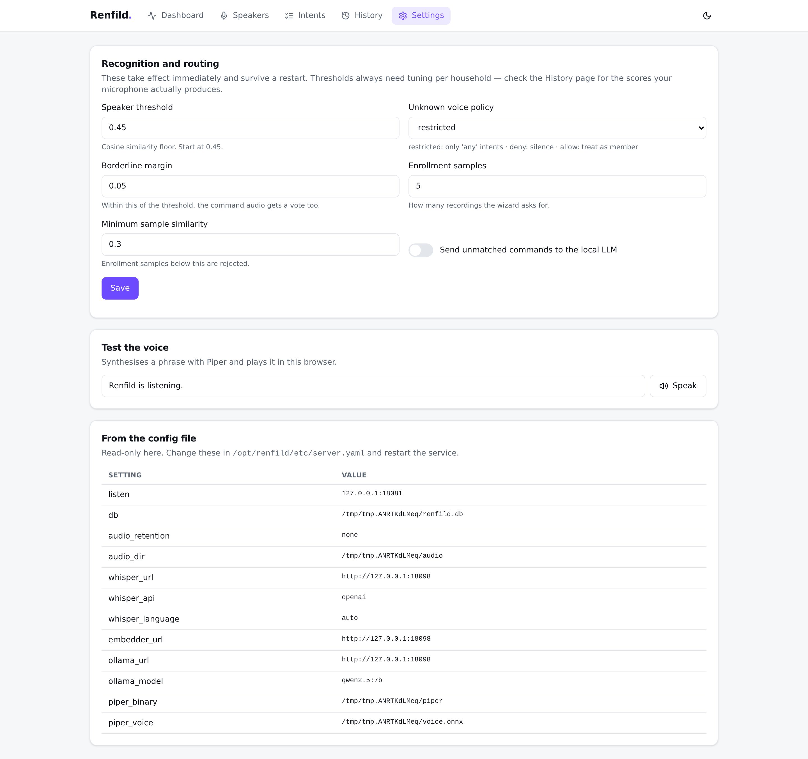
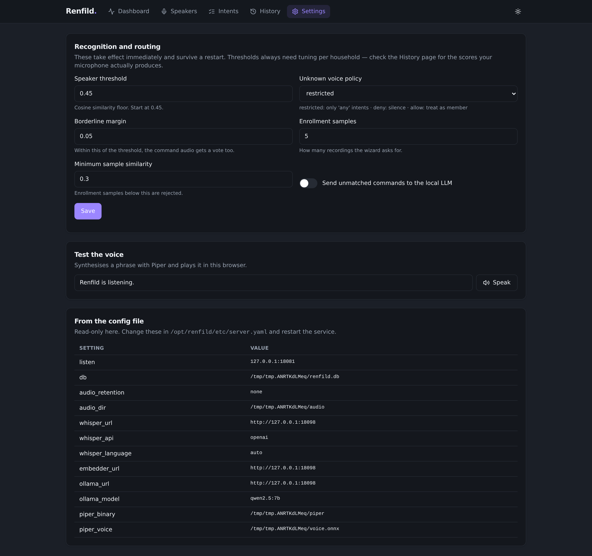

---

## Training a wake word

Renfild does not ship a wake word — you train your own, which is what makes it *yours*. The
phrase for this household is **"Hey Renfild"**, and the satellite expects the model at
`/opt/renfild/satellite/models/hey_renfild.onnx`.

1. Open the [openWakeWord training notebook](https://colab.research.google.com/drive/1q1oe2zOyZp7UsB3jJiQ1IFn8z5YfjwEb)
   in Google Colab (linked from the [openWakeWord repository](https://github.com/dscripka/openWakeWord)).
   Training needs a GPU — it is not something a Pi can do.
2. Set the target phrase to `hey renfild`. **Check the generated samples before you train**:
   the sample generator pronounces through espeak, and an invented name can come out wrong.
   If it does, add spelling variants (`hey ren field`, `hey renfeld`) so the model learns the
   way you actually say it rather than the way espeak reads it.
3. Run the notebook. It synthesises thousands of positive samples, trains against a large
   negative set, and hands you `.tflite` and `.onnx` files.
4. Copy either one to `/opt/renfild/satellite/models/hey_renfild.onnx` (or `.tflite` — the
   inference backend is chosen from the extension; both work).
5. Check it before trusting it, with the tool below.
6. `sudo systemctl restart renfild-satellite`, then watch `journalctl -u renfild-satellite -f`.

### Trying the pipeline before you have trained anything

Training needs a GPU and an afternoon, and until it is done the satellite has nothing to
listen for — the installer deliberately leaves it enabled but stopped rather than
restart-looping. openWakeWord ships pretrained models inside its own package, so you can
borrow one to get the rest of the system working end to end:

```bash
cp /opt/renfild/satellite/.venv/lib/python3*/site-packages/openwakeword/resources/models/hey_jarvis_v0.1.onnx \
   /opt/renfild/satellite/models/
# point wake.model_path at it, then
sudo systemctl start renfild-satellite
```

`alexa_v0.1`, `hey_mycroft_v0.1` and `hey_rhasspy_v0.1` are there too. Replace it with your
own model when it is ready; a stranger's wake word is fine for a bring-up, not for a
household.

> On CPython 3.12 and newer there is no `tflite-runtime` wheel; the satellite transparently
> uses Google's `ai-edge-litert` interpreter instead, so `.tflite` models still work. Both
> backends were verified on this Pi against openWakeWord's pretrained `hey_jarvis` model: the
> wake phrase peaked at **0.999** on each, while an unrelated sentence and silence both scored
> **0.000**.

### Choosing the threshold

`hack/wake-check.py` speaks the phrase in every voice you point it at — at three speaking
rates, alone and running into a command — then scores a set of negatives: ordinary household
sentences, and deliberate near-misses derived from your phrase. It sweeps the threshold and
tells you where the gap is.

```bash
satellite/.venv/bin/python hack/wake-check.py \
    --model /opt/renfild/satellite/models/hey_renfild.onnx \
    --phrase "Hey Renfild" \
    --voices /opt/renfild/piper/voices/*.onnx
```

Run against the pretrained `hey_jarvis` model, it produces:

```
quietest wake word:        0.996
loudest everyday sentence: 0.000
loudest near-miss:         0.993

 threshold    detected   everyday  near-miss
       0.5       12/12          0          4
       0.9       12/12          0          3

suggested wake.threshold: 0.5
```

Two things to read there. Ordinary speech never comes close, which is what you want. But the
bare name "Jarvis." scores 0.99 — no threshold tells it apart from the full phrase. That is a
property of the model, not a bug, and whether it matters is your call: a wake word that also
answers to the name alone is often *preferable*. The tool reports it rather than deciding.

The suggested value is a starting point measured on synthetic speech, which is cleaner than a
room with a television in it. Confirm it against your own logs.

### Testing without a microphone

The satellite can replay a WAV instead of opening the microphone, which is how the wake word
and capture loop get exercised on a headless box:

```bash
python -m satellite --config config.yaml --input-wav session.wav --offline --dump-dir /tmp/renfild
```

It runs the real wake model, the real VAD and the real capture loop, writes the same
`wake.wav`/`command.wav` pair a live detection would, and suppresses playback so no sound
hardware is needed. Drop `--offline` to send the result to a running server.

---

## Enrolling a speaker

Enrollment teaches Renfild what you sound like. **Speakers → Add**, then **Enroll**, and the
wizard walks through five prompts: the wake word twice, two fixed sentences and one free
sentence. Record from where you normally stand, at your normal volume.

Each sample is embedded and compared with the ones already collected. A recording that does
not resemble the others — a cough, a slammed door, someone else talking over you — is
rejected on the spot with the similarity score, so bad samples never reach the voice print.

The **Test my voice** panel records a few seconds and shows what Renfild thinks, with the
score for every enrolled speaker. Nothing is stored.

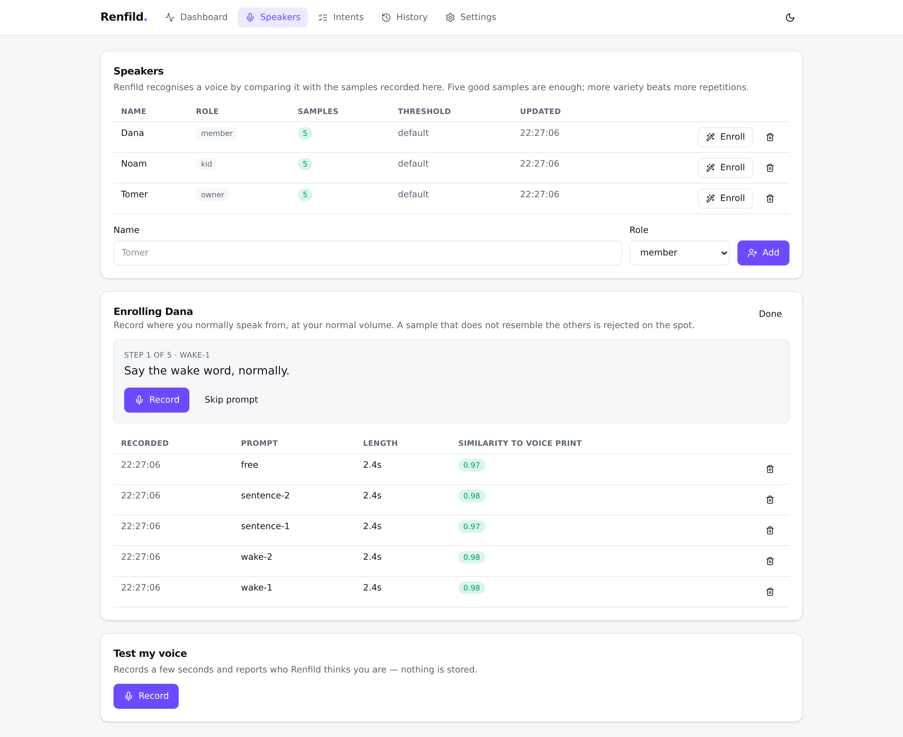

### Threshold tuning

The default threshold is a **cosine similarity of 0.45**. It will need adjusting for your
household and your microphone — this is normal and expected.

| What you see | What it means | What to do |
|---|---|---|
| You are often `unknown` | Threshold is too high for your mic | Lower it by 0.05 at a time |
| Someone else is recognised as you | Voices are too close, or too few samples | Raise the threshold; enroll more samples for both |
| Scores hover around 0.40–0.50 for everyone | Noisy or distant microphone | Move the mic; enroll from where you actually speak |
| One person is always wrong | That person's samples are poor | Delete the low-similarity samples and re-record |

Every utterance logs the **best and runner-up scores** — the History page is where you tune.
The gap between the two matters more than the absolute numbers.

#### What the scores look like in practice

`hack/speaker-eval.py` enrolls a set of voices, then identifies held-out clips of each and
prints the score matrix. Run against four enrolled speakers plus one who is not enrolled:

| | own voice | best impostor | unenrolled stranger's best |
|---|---|---|---|
| Score range | 0.75 – 0.88 | −0.06 – 0.32 | 0.32 |

Twenty of twenty clips were classified correctly at the default 0.45 threshold, with the
stranger correctly reported as `unknown`. Wake-length clips (1.0–1.5 s) scored as reliably as
full commands, which matters because identification runs on the 2 s wake snapshot.

> **Read that as a ceiling, not a promise.** That corpus is synthesised — each "speaker" is a
> different Piper voice, which makes them cleaner and more distinct than four members of one
> household talking across a room. Real voices score lower and sit closer together. Use the
> tool to see the *shape* of the numbers on your own hardware, and tune from your own History
> page.

```bash
satellite/.venv/bin/python hack/speaker-eval.py \
    --voices /opt/renfild/piper/voices/*.onnx
```

---

## Intents

Rules are checked from the top down; the first enabled rule that matches wins.

| Field | Meaning |
|---|---|
| `match_type` | `exact`, `contains` or `regex` (case-insensitive; Hebrew is handled as-is) |
| `patterns` | One or more phrases; any of them matching fires the rule |
| `min_role` | Permission floor: `any` < `kid` < `member` < `owner` |
| `handler` | `reply`, `webhook` or `llm` |
| `priority` | Lower runs first |

Handler configuration is JSON:

```jsonc
// reply — a Go text/template
{ "template": "Good morning {{.Speaker}}. It is {{.Now.Format \"15:04\"}}." }

// webhook — call something, optionally speak its answer
{ "url": "http://nas:8123/api/x", "method": "POST",
  "headers": { "X-Token": "…" },
  "body": "{\"who\":\"{{.Speaker}}\"}",
  "speak_response": true }

// llm — ask the local model, with the speaker's name and role in context
{ "system_prompt": "You are a terse butler.", "max_words": 40 }
```

Templates get `{{.Speaker}}`, `{{.Role}}`, `{{.Transcript}}`, `{{.SatelliteID}}`,
`{{.Confidence}}`, `{{.Known}}` and `{{.Now}}`.

**Unknown voices** are governed by `speaker.unknown_policy`:

| Policy | Behaviour |
|---|---|
| `restricted` (default) | Only intents with `min_role: any` run; anything else gets *"Sorry, I don't recognize your voice."* |
| `deny` | An unrecognised voice gets no response at all |
| `allow` | Treated as a `member` — convenient, and exactly as safe as that sounds |

---

## Voices and languages

The installer downloads one voice from
[rhasspy/piper-voices](https://huggingface.co/rhasspy/piper-voices); the URL is derived from
the name, so picking another one is a single setting:

```bash
sudo PIPER_VOICE=he_IL-saspeech-medium ./install.sh --skip-satellite --skip-embedder --skip-server
```

### Hebrew

Hebrew works, but not with the default engine. The `rhasspy/piper` release binary has been
frozen at `2023.11.14` since the project moved, and it cannot load a Hebrew voice at all — it
aborts on the phoneme map:

```
[piper] [error] "aɪ" is not a single codepoint (ids=161,)
terminate called after throwing an instance of 'std::runtime_error'
  what():  Phonemes must be one codepoint (phoneme id map)
```

[piper1-gpl](https://github.com/OHF-Voice/piper1-gpl) is the maintained successor and speaks
it fine. Set `piper.engine: "python"` and point `piper.binary` at
`/opt/renfild/piper/venv/bin/piper`. `PIPER_ENGINE=auto` (the default) picks it for you when
the voice name starts with `he_`, and installs it into its own virtualenv.

`he_IL-saspeech-medium` is currently the only Hebrew voice published in that collection.

## Speech to text

Whisper is an external service — `whisper.url` is configuration, not code — so anything
OpenAI-compatible works. If you do not already have one,
[`hack/whisper-server.sh`](hack/whisper-server.sh) builds [whisper.cpp](https://github.com/ggml-org/whisper.cpp)
and installs it as a systemd unit:

```bash
sudo apt-get install -y cmake
sudo ./hack/whisper-server.sh              # or MODEL=tiny for the fastest
```

whisper.cpp's server already speaks the OpenAI request shape; it just serves it at
`/inference`, so the script runs it with `--inference-path /v1/audio/transcriptions` and
Renfild's `whisper.api: "openai"` works unchanged.

### It is slow on the Pi, and that is the honest answer

Whisper always processes a 30-second window, so a two-second command costs the same as a
long one. Measured here on a Pi 4 (4 threads, ~2 s of English speech):

| Model | Per command | English | Hebrew |
|---|---|---|---|
| `tiny` | **~5.1 s** | accurate | close, two words wrong |
| `base` | **~14.9 s** | accurate | close, one word wrong |
| `small` | **~63 s** | accurate | close, one word wrong |

Even `tiny` blows the 2.5 s target on its own. Speech to text is the one component that
really wants a stronger machine: point `whisper.url` at a desktop, a NAS or a mini PC and the
Pi goes back to being fast. Everything else in the pipeline is comfortable where it is.

The Hebrew clips were synthesised with Piper, so the errors above are the TTS and the STT
compounding — a real speaker does better. Set `whisper.language: "he"` rather than leaving it
on `auto` if the household speaks one language; detection on a two-second command is not
reliable.

### End to end, measured

A full round trip on this Pi, with `whisper-tiny` local, one enrolled speaker and a rule that
matches — wake audio in, reply WAV out:

| Stage | Time |
|---|---|
| `spk` (embed + match) | 1.4 – 1.8 s, concurrent with `stt` |
| `stt` (whisper-tiny, local) | 5.2 – 5.6 s |
| `intent` (rule) | 0 – 11 ms |
| `tts` (Piper, persistent) | 0.8 – 0.9 s |
| **total** | **6.0 – 6.5 s** |

Move Whisper off the Pi and that total drops to roughly two seconds, because `stt` stops
being the whole of it and `spk` is already hidden behind it.

Swap the rule for the LLM fallback and it goes the other way: **12.6 s** warm, **47.4 s** on
the first call after the model has been unloaded — past the satellite's own 15 s timeout.
See the next section.

---

## The LLM fallback

Ollama runs on a Pi 4, but not quickly. Measured here with `qwen2.5:1.5b`, which is as large
as a 4 GB Pi will comfortably hold:

| | Time to a one-sentence answer |
|---|---|
| First call after the model is unloaded | **~40 s** |
| Warm | 4.4 – 9.0 s |

Ollama unloads an idle model after five minutes by default, so an assistant used a few times
a day would pay the cold cost almost every time. `OLLAMA_KEEP_ALIVE=-1` pins it in memory at
the cost of about a gigabyte of RAM. Even warm, this is far outside the 2.5 s target and past
the satellite's 15 s request timeout on a bad day — the LLM fallback is worth having on a
stronger host, and worth thinking twice about on the Pi. Rules cost under 10 ms; use them for
anything you say often.

The shipped default is `qwen2.5:7b`, which a 4 GB Pi cannot load at all. That is deliberate —
the default assumes Ollama lives somewhere else. If you point it at the Pi, drop the model
size and accept the latency. Renfild handles the failure the way it is supposed to either
way: an unreachable or missing model produces a spoken *"Sorry, something went wrong."* and a
`200`, never a raw error to the satellite, with the real reason recorded on the History page.

---

## Configuration reference

Precedence everywhere: **flags > environment > config file > defaults**.

### server — `/opt/renfild/etc/server.yaml` (env prefix `RENFILD_`)

| Key | Default | Meaning |
|---|---|---|
| `listen` | `:8080` | Listen address. Bind to `127.0.0.1:8080` if you put a proxy in front. |
| `db` | `/var/lib/renfild/renfild.db` | SQLite database |
| `log_level` | `info` | `debug`, `info`, `warn`, `error` |
| `audio_retention` | `none` | `none`, `24h`, `7d` — raw audio retention for debugging |
| `audio_dir` | `/var/lib/renfild/audio` | Where retained audio is written |
| `whisper.url` | `http://127.0.0.1:9000` | Whisper endpoint. **There is no working default — point this at your own.** |
| `whisper.api` | `openai` | `openai` (`/v1/audio/transcriptions`) or `asr` (whisper-asr-webservice) |
| `whisper.model` | `whisper-1` | Model name, for the OpenAI shape |
| `whisper.language` | `auto` | `he`, `en`, … or `auto` |
| `whisper.timeout` | `20s` | Per-request timeout |
| `embedder.url` | `http://127.0.0.1:8100` | Embedder sidecar |
| `ollama.url` | `http://127.0.0.1:11434` | Ollama endpoint |
| `ollama.model` | `qwen2.5:7b` | Model for the `llm` handler |
| `ollama.max_words` | `60` | Hard cap on spoken answers |
| `ollama.fallback` | `true` | Route unmatched transcripts to the model |
| `ollama.system_prompt_file` | — | Optional file with your own system prompt |
| `piper.engine` | `cpp` | `cpp` (the rhasspy/piper binary) or `python` (piper1-gpl). Hebrew voices need `python` |
| `piper.binary` | `/opt/renfild/piper/piper` | Piper executable. `…/piper/venv/bin/piper` for the `python` engine |
| `piper.voice` | `…/en_US-lessac-medium.onnx` | Voice model |
| `piper.speaker_id` | `0` | For multi-speaker voices |
| `piper.persistent` | `true` | Keep one Piper process alive between replies. Worth about a second per reply |
| `piper.timeout` | `10s` | Per-reply timeout |
| `speaker.default_threshold` | `0.45` | Cosine similarity floor |
| `speaker.unknown_policy` | `restricted` | See the table above |
| `speaker.low_confidence_margin` | `0.05` | Within this of the threshold, the command audio also gets a vote |
| `speaker.enrollment_samples` | `5` | Prompts in the enrollment wizard |
| `speaker.min_sample_similarity` | `0.30` | Enrollment samples below this are rejected |

Flags: `--listen --db --log-level --audio-retention --audio-dir --whisper-url --whisper-api
--whisper-language --embedder-url --ollama-url --ollama-model --piper-engine --piper-binary
--piper-voice --piper-persistent --speaker-threshold --unknown-policy --config`.

### satellite — `/opt/renfild/etc/satellite.yaml` (env prefix `RENFILD_SAT_`, nested keys use `__`)

| Key | Default | Meaning |
|---|---|---|
| `satellite_id` | `living-room` | Identifies this satellite in history and metrics |
| `server.url` | `http://127.0.0.1:8080` | Where the brain lives |
| `server.timeout_s` | `15` | Request timeout |
| `audio.input_device` | `USB` | **Name substring**, never an index — indexes move between reboots |
| `audio.output_device` | `USB` | Same, for playback |
| `audio.sample_rate` | `16000` | Fixed by the models |
| `audio.frame_ms` | `80` | 1280 samples — openWakeWord's chunk size |
| `audio.ring_seconds` | `2.0` | Snapshot handed to speaker identification |
| `wake.model_path` | `models/renfild.onnx` | Your trained wake word (`.onnx` or `.tflite`) |
| `wake.threshold` | `0.6` | Raise it if the TV sets it off |
| `wake.debounce_s` | `3.0` | Suppress re-triggers after a detection |
| `vad.model_path` | `models/silero_vad.onnx` | Silero VAD; falls back to an energy gate if missing |
| `vad.trailing_silence_ms` | `700` | End-of-command silence |
| `vad.max_command_s` | `10.0` | Hard cap on one command |
| `vad.start_timeout_s` | `4.0` | No speech within this → false trigger, abort quietly |
| `chimes.enabled` | `true` | Local feedback sounds (synthesised, no files needed) |
| `dump_dir` | — | Write `wake.wav`/`command.wav` for every detection |
| `offline` | `false` | Capture and dump only; never contact the server |

Example: `RENFILD_SAT_WAKE__THRESHOLD=0.7` overrides `wake.threshold`.

### embedder — `/opt/renfild/etc/embedder.env` (env prefix `RENFILD_EMB_`)

| Key | Default | Meaning |
|---|---|---|
| `HOST` / `PORT` | `127.0.0.1` / `8100` | Bind address — localhost by default, since only the server talks to it |
| `MODEL_SOURCE` | `speechbrain/spkrec-ecapa-voxceleb` | HuggingFace id or a local directory |
| `MODEL_DIR` | `models/spkrec-ecapa-voxceleb` | Weight cache; offline after the first start |
| `TORCH_THREADS` | `3` | Leave a core for the rest of the stack |
| `MIN_DURATION_S` | `0.5` | Shorter audio is rejected with 422 |
| `STUB` | `false` | Serve fake embeddings (tests only) |

---

## API

| Method | Path | Purpose |
|---|---|---|
| `POST` | `/api/v1/utterance` | Satellite endpoint. `multipart/form-data`: `wake`, `command`, `satellite_id`. Returns `200` + `audio/wav`, or `204` when there is nothing to say. Headers: `X-Speaker`, `X-Transcript`, `X-Intent`, `X-Confidence` (percent-encoded UTF-8). |
| `GET` | `/healthz` | Liveness, with the version |
| `GET` | `/metrics` | Prometheus: utterance counts by speaker/intent/outcome, per-stage latency histograms, match-confidence histogram |

A Grafana dashboard over these metrics lives in [`grafana/`](grafana/), with the scrape
config and import instructions.
| `GET/POST/PUT/DELETE` | `/api/ui/speakers…` | Speaker and enrollment management |
| `POST` | `/api/ui/speakers/identify` | "Test my voice" — embed and match, storing nothing |
| `GET/POST/PUT/DELETE` | `/api/ui/intents…` | Rule table CRUD, plus `/reorder` |
| `GET` | `/api/ui/history` | Utterance history with paging, search and filters |
| `GET` | `/api/ui/events` | Server-Sent Events stream of live utterances |
| `GET/PUT` | `/api/ui/settings` | Runtime settings (thresholds, policies, LLM fallback) |
| `POST` | `/api/ui/test/tts` · `/api/ui/test/intent` | Dry runs for the UI |

---

## Privacy

- Everything runs on your LAN. Nothing is sent anywhere at runtime; the only downloads are
  models, at install time.
- **Raw audio is not stored by default** (`audio_retention: none`). Turn it on only while
  debugging.
- **Transcripts and voice embeddings are stored** in `/var/lib/renfild/renfild.db`. The
  embeddings are 192 floats per speaker — not audio, but they are biometric data. Treat the
  database accordingly.
- **The web UI has no authentication in v1.** It assumes a trusted LAN. Do not expose port
  8080 to the internet, and do not put it behind a tunnel without adding authentication in
  front of it. Bind to `127.0.0.1` and use a reverse proxy with auth if you need remote access.
- Webhook credentials configured in intents are stored in the database; keep it at `0640`
  and owned by the `renfild` user, as the installer sets it.

---

## Troubleshooting

**No audio devices / the satellite exits at startup**

```bash
arecord -L                 # capture devices
aplay -L                   # playback devices
sudo -u renfild /opt/renfild/satellite/.venv/bin/python -m satellite --list-devices
```
Set `audio.input_device` to a distinctive substring of the name (`"USB"`, `"Samson"`). If
PortAudio itself is missing: `sudo apt install libportaudio2`.

**The wake word never fires**

Lower `wake.threshold` in steps of 0.05 and watch `journalctl -u renfild-satellite -f`.
Record what the microphone actually hears with `--offline --dump-dir /tmp/renfild` and play
the dumps back — if they are quiet or clipped, fix the gain with `alsamixer` first.

**The wake word fires at the television**

Raise `wake.threshold`, and consider retraining with a longer phrase. Three or four
syllables is the sweet spot.

**Everyone comes out as `unknown`**

Check the scores on the History page. If the best match sits just under the threshold,
lower `speaker.default_threshold`. If every score is below 0.30, the enrollment samples
were probably recorded somewhere else — re-enroll from where you actually talk.

**Replies are slow**

The History page breaks every utterance down by stage. Typically:

| Stage | Measured on a Pi 4 (4 GB) | If it is slow |
|---|---|---|
| `spk` (speaker ID) | 1.4 – 1.8 s for a 2 s wake snapshot | ECAPA on a Pi 4 CPU. It runs concurrently with `stt`, so it is usually not what you are waiting for — but if it is, move the embedder to a stronger host: `embedder.url` is just configuration. |
| `stt` (Whisper) | **~5.2 s with whisper-tiny on the Pi**, a few hundred ms on a real machine | This is almost always the answer. See [Speech to text](#speech-to-text) |
| `intent` | < 10 ms for rules, seconds for `llm` | An LLM reply is never going to be instant; keep `max_words` low |
| `tts` (Piper) | **~1.45 s for a short reply** | See below |

**Most of Piper's cost is loading the voice, so the process is kept alive.** With
`piper.persistent: false` the server spawns Piper per reply and pays roughly a second of
model loading every time; with it left on (the default) one process is started at boot and
each reply only pays for synthesis:

| Engine | Voice | Per reply, one-shot | Per reply, persistent |
|---|---|---|---|
| `cpp` | `en_US-lessac-medium` | 2.6 s | **1.45 s** |
| `python` | `he_IL-saspeech-medium` | 6.2 s | **1.4 s** |

Both were measured on this Pi with the same sentence, and the persistent figures hold from
the first reply onwards — the voice is loaded at startup, not on first use. The Python engine
is slower to start (about six seconds) because it is loading an interpreter and onnxruntime
as well as the voice, but once warm the two engines are within noise of each other.

The embedder also spends 15–20 seconds loading ECAPA at startup. That happens once, at boot,
not per utterance.

Wake word and VAD are cheap enough to ignore: on the same Pi, openWakeWord costs 15.9 ms per
80 ms frame on ONNX and 11.8 ms on TFLite, and Silero VAD costs 3.5 ms — together well under
a quarter of one core in real time.

**`piper: no such file or directory`**

The server logs "text to speech is unavailable" at startup and keeps running. Re-run
`sudo ./install.sh --skip-satellite --skip-embedder --skip-server` to fetch Piper, or
install it by hand into `/opt/renfild/piper`.

**`systemctl status renfild-satellite` says "failed" or "inactive" after installing**

Expected on a fresh install: the satellite needs a wake word model and there isn't one yet.
It exits 78 (`EX_CONFIG`) and stops rather than restarting every five seconds forever — the
journal line says exactly which file it wanted. Drop the model in, then:

```bash
sudo systemctl start renfild-satellite
```

The installer enables the unit but deliberately does not start it until a model is present.

**The embedder takes forever to start**

The first start downloads ~80 MB of model weights. `journalctl -u renfild-embedder -f`
shows the progress; subsequent starts are offline and take a few seconds.

---

## Roadmap

- Barge-in (interrupting playback by speaking) — deliberately out of scope for v1.
- Multiple satellites. The protocol already carries `satellite_id`; the UI does not manage
  them yet.
- More intent handlers — MQTT and `exec` are one file each, by design.
- Streaming speech to text.

## License

[Apache-2.0](LICENSE)
